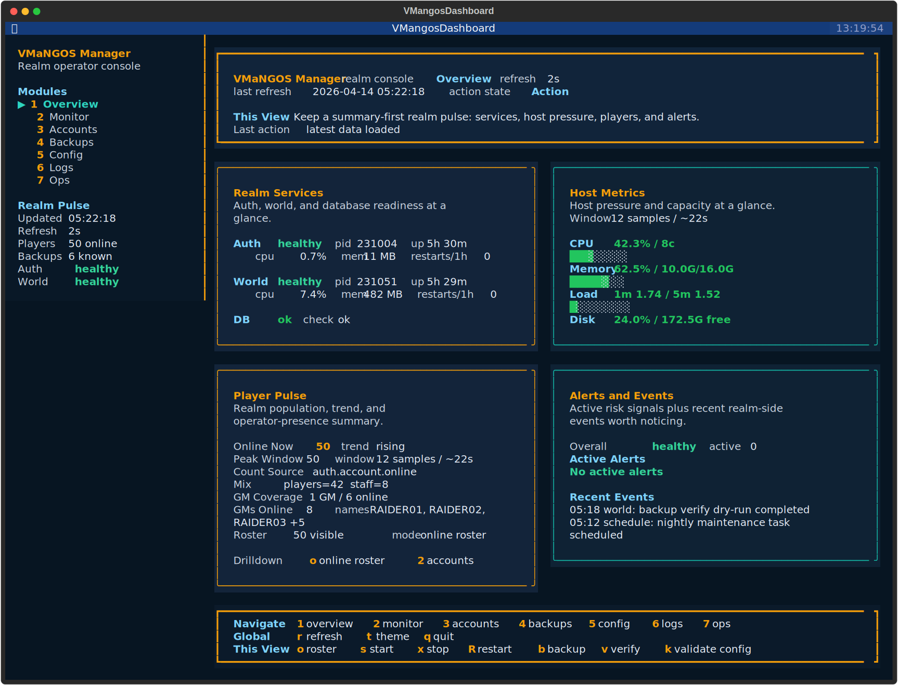

# VMaNGOS Manager


Operate a VMaNGOS realm like a product, not a pile of shell scraps, one-off SQL, and tribal knowledge. VMaNGOS Manager turns install automation, day-two operations, backups, account administration, and update planning into one terminal-native admin product built for real realm operators.

VMaNGOS already gives you the server core. Manager gives you the operator layer communities usually have to assemble for themselves: a real terminal dashboard, safer recurring workflows, and one consistent control surface for the work that normally gets scattered across shell history, handwritten notes, and ad hoc scripts.



The screenshot above is generated from the shipped dashboard renderer against a reproducible demo snapshot. It is not a painted mockup.

## Why Operators Reach For It

- bring a fresh Ubuntu host online with `VMANGOS only` or `VMANGOS + Manager`
- adopt an existing realm through config detection instead of a forced rebuild
- run a real Textual TUI directly on the server over SSH
- manage accounts, backups, logs, schedules, config checks, and update prep from one surface
- rely on one operational backend shared by the CLI, dashboard, and automation flows

The result is less improvisation and more repeatable operations from a surface that feels deliberate.

## Why It Feels Different

Most VMaNGOS tooling assumes the operator is willing to live in shell fragments forever. Manager takes the opposite stance: terminal-first does not have to mean rough, fragmented, or forgettable.

That is why the product matters. It gives realm operators something they are not used to getting: a server admin experience that is still SSH-native, but finally feels like software instead of glue.

## Start The Right Way

### Fresh Host

For a blank Ubuntu 22.04 machine, the repo ships two installer entry points. Both can provision either:

- `VMANGOS only`
- `VMANGOS + Manager`

Both paths support:

- `Automated`
- `Guided`

Automated install:

```bash
wget https://raw.githubusercontent.com/tonymontoya/VMANGOS-Manager/main/auto_install.sh
wget https://raw.githubusercontent.com/tonymontoya/VMANGOS-Manager/main/vmangos_setup.sh
sudo bash auto_install.sh
```

Guided install:

```bash
wget https://raw.githubusercontent.com/tonymontoya/VMANGOS-Manager/main/vmangos_setup.sh
sudo bash vmangos_setup.sh
```

The installer handles the heavy lifting that usually gets lost in private notes:

- dependency installation and long-build orchestration
- database creation and credentials
- config generation
- client data staging
- manager provisioning under `/opt/mangos/manager`
- dashboard prerequisites when Manager is included

`auto_install.sh` stays non-interactive and defaults to `VMANGOS + Manager` with automated inputs. `vmangos_setup.sh` prompts early for the provisioning target and input mode so the operator knows exactly what path they are taking before the long-running phases start.

### Existing Host

If you already have VMaNGOS running, Manager does not force you into a reinstall story. Install it, detect the local layout, then launch the dashboard:

```bash
git clone https://github.com/tonymontoya/VMANGOS-Manager.git
cd VMANGOS-Manager/manager
make test
sudo make install PREFIX=/opt/mangos/manager
sudo /opt/mangos/manager/bin/vmangos-manager config detect
sudo /opt/mangos/manager/bin/vmangos-manager dashboard --bootstrap
sudo /opt/mangos/manager/bin/vmangos-manager dashboard --refresh 2
```

## The Interface That Sells It

The dashboard is the thing most VMaNGOS admins are not used to getting: a terminal UI that actually earns its screen space.

It is not a detached frontend experiment. It runs on the same Manager commands and JSON surfaces used by the CLI, which keeps the interface honest and useful on a real server.

Bootstrap once:

```bash
sudo /opt/mangos/manager/bin/vmangos-manager dashboard --bootstrap
```

Launch it:

```bash
sudo /opt/mangos/manager/bin/vmangos-manager dashboard --refresh 2
```

Inside the dashboard you get:

- auth/world service health, PID, uptime, and control actions
- host CPU, memory, disk, load, disk I/O, and short-term monitoring trends
- player pulse summary, GM presence, alert visibility, and online roster drilldown
- backup visibility plus verify, schedule, and restore dry-run entry points
- account workflows for create, password reset, GM level changes, and ban or unban actions
- a dedicated Ops surface for maintenance queue visibility, update readiness, and log guardrails

It keeps the deployment terminal-first while still giving admins something that looks credible, legible, and worth keeping open.

## How To Read The Dashboard

The dashboard is organized around a simple split:

- the top banner tells you where you are, what that view is for, and what the last action did
- the left sidebar keeps navigation and realm pulse visible from every screen
- the bottom command rail is the canonical action surface for the current view
- the main panels are view-specific and should stay scoped to the thing they are showing

That last point matters. Summary panels should answer operator decisions first. Inventory tables feed selected-detail panes, and selected-detail panes stay item-scoped: selected player, selected account, selected backup, selected schedule.

## What The Dashboard Covers Today

The dashboard already covers the work most realm operators do every week. The CLI remains available for automation, raw output, and a few advanced or higher-friction paths.

| Area | In the dashboard now | Best handled in the CLI |
| --- | --- | --- |
| Server | status, start, stop, restart | watch mode, raw JSON |
| Accounts | account inventory, create, reset password, set GM, ban, unban, visibility | scripted bulk workflows |
| Backups | backup readiness, inventory, create, verify, restore dry-run, timer visibility, daily/weekly timer create | cleanup, timer removal, real restore |
| Config | validation plus read-only configuration wiring summary | detect, create, show, file editing |
| Operations | maintenance queue, maintenance/restart scheduling, cancel schedule, update readiness, log guardrails | update apply and source-tree work |

The user guide tracks these boundaries in more detail and is the best place to see the current product surface with screenshots.

## Start Here

- [User guide](docs/user-guide.md)
- [Install automation reference](docs/install-automation.md)
- [CLI reference](docs/cli-reference.md)
- [Troubleshooting](docs/troubleshooting.md)
- [Security notes](docs/security.md)

Start with the user guide if you want the best end-to-end walkthrough of what Manager can do.

## Why It Is Credible

- validated on a real Ubuntu VMaNGOS host, not just mocked local shell tests
- the dashboard screenshot in this README is generated from the shipped Textual app export path using a reproducible demo payload
- the test suite covers config, status, logs, schedule, backup, update, account, and dashboard seams

## VMaNGOS Context

VMaNGOS is an independent continuation of the Elysium/LightsHope codebases focused on accurate Vanilla WoW content progression across patch eras from 1.2 through 1.12.1.

## Resources

- [VMaNGOS Core](https://github.com/vmangos/core)
- [VMaNGOS Database](https://github.com/brotalnia/database)
- [VMaNGOS Wiki](https://github.com/vmangos/wiki/wiki)
- [Issue Tracker](https://github.com/tonymontoya/VMANGOS-Manager/issues)

## License & Disclaimer

This project is for educational purposes. Running a private WoW server may violate Blizzard's Terms of Service. Use at your own risk.
