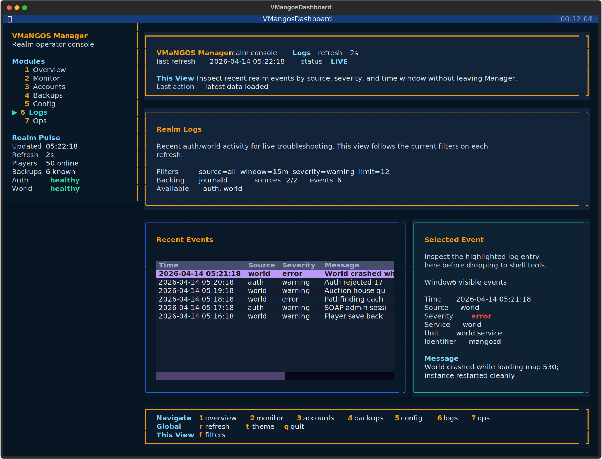

# User Guide

VMaNGOS Manager is at its best when you use it as a complete operator layer, not just a pile of commands. This guide is the shortest path from install to confident day-to-day operation.

It shows you how to:

- bring Manager onto a fresh or existing VMaNGOS host
- launch the dashboard and understand each screen
- use the built-in workflows for monitoring, accounts, backups, config checks, logs, schedules, and update planning
- settle into a practical daily operating routine

All screenshots in this guide are generated from the shipped dashboard renderer against a reproducible demo snapshot.

## Choose Your Starting Path

### Fresh Ubuntu 22.04 Host

Use the installer when you want Manager to help bring the whole realm online.

Fast path:

```bash
wget https://raw.githubusercontent.com/tonymontoya/VMANGOS-Manager/main/auto_install.sh
wget https://raw.githubusercontent.com/tonymontoya/VMANGOS-Manager/main/vmangos_setup.sh
sudo bash auto_install.sh
```

Use this when you want:

- the lowest-friction way to provision `VMANGOS + Manager`
- generated credentials and sane defaults
- one repeatable installer path instead of a private host checklist

If you want more control during install, use:

```bash
wget https://raw.githubusercontent.com/tonymontoya/VMANGOS-Manager/main/vmangos_setup.sh
sudo bash vmangos_setup.sh
```

That guided path lets you choose install root, DB values, provisioning target, and related host settings.

For deeper installer details, use the [install automation reference](install-automation.md).

### Existing VMaNGOS Host

If the realm is already running, Manager can adopt it without forcing a rebuild.

```bash
git clone https://github.com/tonymontoya/VMANGOS-Manager.git
cd VMANGOS-Manager/manager
make test
sudo make install PREFIX=/opt/mangos/manager
sudo /opt/mangos/manager/bin/vmangos-manager config detect
sudo /opt/mangos/manager/bin/vmangos-manager dashboard --bootstrap
sudo /opt/mangos/manager/bin/vmangos-manager dashboard --refresh 2
```

The key step is `config detect`. It gives Manager a read-only first pass at your existing realm layout so you are not wiring every path, service, and database by hand.

## First Dashboard Launch

After Manager is installed, bootstrap the Textual runtime once:

```bash
sudo /opt/mangos/manager/bin/vmangos-manager dashboard --bootstrap
```

Then launch the operator console:

```bash
sudo /opt/mangos/manager/bin/vmangos-manager dashboard --refresh 2
```

The dashboard is organized into seven views:

- `Overview`
- `Monitor`
- `Accounts`
- `Backups`
- `Config`
- `Logs`
- `Ops`

The command rail shows the most important actions for the active screen, while the sidebar keeps navigation and realm pulse visible at all times.

## Start With The Task

If you are unsure which screen to open first, use this quick map:

| Operator task | Start in | Finish in |
| --- | --- | --- |
| Confirm the realm is healthy right now | `Overview` | stay in `Overview` or escalate to `Monitor` / `Logs` |
| Explain CPU, memory, load, disk, or I/O pressure | `Monitor` | stay in `Monitor` until you understand the pressure source |
| Create or moderate a player account | `Accounts` | stay in `Accounts` until the selected account state refreshes |
| Confirm protection before risky work | `Backups` | stay in `Backups` for verify or restore dry-run |
| Investigate recent auth/world failures | `Logs` | stay in `Logs` for evidence, then move to `Ops` only if it becomes maintenance work |
| Schedule maintenance or a restart window | `Ops` | stay in `Ops` until the new task appears in `Scheduled Tasks` |
| Prepare for a risky code or DB change | `Ops` | use `Ops` plus `Backups`, then continue the actual apply path in the CLI |
| Validate install paths, service names, or DB wiring | `Config` | stay in `Config` until the wiring view looks correct |

## How To Read The Screen

The dashboard works best when each region has a clear job:

- the top banner tells you the active view, why that view exists, and the state of the last action
- the top banner also carries the action receipt and recommended next step for higher-impact workflows
- the sidebar is always-on navigation plus realm pulse
- the command rail is the single action surface for navigation, refresh, and view-specific work
- the main panels are where view-specific work happens

The rule to keep in mind is simple:

- summary panels answer the operator question first
- detail panes belong to the selected row or selected object

If a panel starts mixing realm-wide counters into a selected-item view, that is usually an IA defect, not an operator requirement.

If you are new to Manager, the best first pass is simple:

1. Start in `Overview` and make sure the host and services look sane.
2. Visit `Monitor` when you want to understand host pressure, disk saturation, or realm process footprint in more detail.
3. Visit `Config` and verify Manager is reading the right install root, service names, and databases.
4. Visit `Backups` and confirm the protection story before you trust any update or maintenance workflow.
5. Visit `Accounts` so you know where user actions live before you need them under pressure.
6. Visit `Logs` when you need recent auth/world evidence without leaving Manager.
7. Finish in `Ops` and review scheduled work plus change-window readiness.

## Overview View


This is the screen you leave open when you want live awareness of the realm.

What it is best at:

- checking whether `auth` and `world` are healthy
- seeing headline CPU, memory, load, disk, player count, and short-term trends
- spotting whether players are actually online and whether staff are present
- jumping quickly into stop, start, restart, backup, verify, and config validation actions

Use this view when:

- you just logged into the host
- you are validating that a restart actually settled
- you want a top-like operational snapshot instead of several separate shell commands
- you want to know whether to worry before you move into the deeper `Monitor` screen

Panel roles in this view:

- `Realm Services` is the fast service and DB pulse plus per-service footprint
- `Host Metrics` is the machine-level headline pressure panel only, using compact numeric summaries plus small capacity meters
- `Player Pulse` is the summary-first population panel: online count, trend, player/staff mix, GM coverage, and roster visibility context
- `Alerts and Events` is the fast-read risk and recent-realm-events panel

If `Overview` tells you something is off but not why, switch to `Monitor`. That split is intentional: `Overview` stays summary-first, while `Monitor` carries the denser diagnostic surface.

The full online roster is still available, but it is now a drill-down instead of taking over summary space:

- press `o` from `Overview` to open the live online roster
- press `Enter` from that roster to jump straight into the selected account in `Accounts`

## Monitor View


Monitor is the diagnosis screen. It exists so `Overview` can stay fast and readable instead of trying to become a cramped terminal copy of `htop`, `df`, and `iostat` all at once.

Use it when you need to:

- explain CPU, memory, load, disk, or I/O pressure instead of just noticing it
- compare current values against the recent monitoring window
- inspect `auth` and `world` process footprint in one place
- understand whether storage contention is likely driving realm instability

Read it in this order:

1. Start with `Pressure Deck` for the current host picture, bar-first capacity usage, and recent peak/trend context.
2. Move to `Realm Process Footprint` to check whether `auth` or `world` is the source of pressure.
3. Use `Trend Ledger` to compare current values against the recent peak window.
4. Finish with `Storage and Device` when disk saturation, filesystem headroom, or missing `iostat` tooling might explain what you are seeing.

This screen is intentionally denser than `Overview`, but it still follows the same rule: each panel has a clear job. The goal is better diagnosis, not more noise.

Two practical rules help here:

- `Overview` is for fast operator confidence and concise headline telemetry
- `Monitor` is where the bar-first pressure readout, peak window, and device context justify the extra density

If you have room, run the dashboard in a taller terminal before you camp on `Monitor`. It makes the trend and storage panels easier to absorb at a glance.

## Accounts View


This is where Manager starts feeling like a real realm admin tool instead of a command wrapper.

Use the Accounts view when you need to:

- create a new account
- reset a password
- assign or remove GM levels
- ban or unban a user
- inspect whether an account is online or already restricted

Recommended flow:

1. Move to `Accounts` with `3`.
2. Highlight the account you care about.
3. Use the command rail actions for this view: `c`, `p`, `g`, `n`, `u`.
4. Let the dashboard feed you back into the updated table state after the action completes.

This is especially useful for GMs and operators who do not want to remember a pile of account-management command forms.

In this view, `Account Inventory` is the inventory and `Selected Account` is the action surface. Global counts should not be mixed into that right-hand pane.

## Backups View


The Backups view turns backup inventory into something you can actually inspect and act on.

Use it to:

- see what backups exist
- confirm when the latest backup was taken
- verify a backup before trusting it
- dry-run a restore plan
- review the currently configured backup timers
- queue daily or weekly backup scheduling

Recommended habit:

1. Use `b` to create a new backup before risky maintenance.
2. Use `v` to verify important backups instead of assuming the archive is good.
3. Use `d` to review a restore dry-run before a real restore event ever happens.

This is one of the biggest quality-of-life wins in Manager. Backup discipline becomes part of the normal operator experience instead of a separate ritual.

Still handled in the shell:

- the dashboard shows protection posture, backup inventory, and configured timer state
- `Backup Readiness` is the summary and selected-backup decision panel
- `Backup Inventory` is the archive list you browse and act from
- creating or replacing daily and weekly backup timers is available in the dashboard
- real restore, cleanup policy changes, timer removal, and deeper backup surgery still live in the CLI or systemd today

## Config View


Config is the confidence screen. It tells you how Manager understands the host it is running on.

Use it to:

- validate the current `manager.conf`
- confirm install root, service names, database host, and DB names
- sanity-check backup directory wiring
- confirm how Manager is sourcing DB credentials without exposing them in plaintext

This screen is especially valuable after:

- adopting an existing host
- changing service names or install paths
- reinstalling Manager onto a machine with an older realm layout

Still handled in the shell:

- this view is intentionally read-only
- edit `manager.conf` and `.dbpass` in the shell, then return here to validate the result

The panel is grouped into `Realm Wiring`, `Database Wiring`, and `Boundary` so it is easier to spot whether the problem is host wiring, DB targeting, or a workflow misunderstanding.

If the configuration wiring view looks wrong, fix that before you trust any higher-level workflow.

## Logs View



Logs is the realm troubleshooting screen. It exists so you can inspect recent `auth` and `world` activity without turning Manager into a generic OS log browser.

Use it to:

- inspect recent realm events and failures by source
- narrow the feed by source, time window, severity, and result count
- keep following the filtered feed as the dashboard refreshes
- inspect a selected event in detail before you drop to shell tools

Read the summary panel in this order:

1. `Events` tells you how much evidence is currently on screen and what happened most recently.
2. `Hot Path` and the source/severity mix tell you whether the problem is concentrated in `auth`, `world`, warnings, or hard failures.
3. `Coverage` and follow/filter support tell you how trustworthy the current feed is before you widen the investigation.

Recommended flow:

1. Move to `Logs` with `6`.
2. Press `f` and set the source, window, severity, and limit that match the investigation.
3. Let the screen auto-refresh while you keep the selected event highlighted in the detail pane.
4. Jump to `Ops` only when the issue turns into maintenance or update work instead of log investigation.

The important scope rule is simple:

- `Logs` is for realm-relevant troubleshooting evidence
- `Ops` is for maintenance readiness, scheduled tasks, and change-window planning

That separation keeps the troubleshooting surface honest and stops the maintenance screen from carrying too many unrelated jobs.

## Operations View


Operations is the maintenance and change-window workflow screen.

Use it for:

- deciding whether log rotation, file hygiene, and disk headroom are in a good state before maintenance
- creating maintenance tasks or restart windows from the Ops surface
- seeing what scheduled work is already queued
- inspecting or canceling the selected task
- reviewing change-window readiness and DB impact before risky source changes

Read it in this order:

1. Start with `Maintenance Readiness` to confirm storage headroom, queue state, and log-rotation posture are not warning about avoidable maintenance friction.
2. Use the on-screen create actions to add a maintenance task or scheduled restart from the Ops surface.
3. Review `Scheduled Tasks` to confirm what is already queued and when it will fire.
4. Use `Selected Task` to inspect origin, cadence, warnings, and cancellation impact for the highlighted item.
5. Use `Change Window Readiness` when the next change involves source pulls or database movement.

Recommended flow before a realm update:

1. Review `Maintenance Readiness` so you know whether log rotation, permissions, and storage headroom look healthy enough for the window.
2. Review `Scheduled Tasks` so you know whether any restart work is already timed near the window.
3. Review `Change Window Readiness` and the DB-impact summary.
4. Generate or refresh the update plan.
5. Take and verify a backup.
6. Only then move into a real update workflow from the CLI.

Tasks shown in `Scheduled Tasks` come from the Ops create actions in the dashboard or the matching `schedule` CLI commands. The screen makes that origin explicit so the queue does not feel detached from the workflow.

## Updates Workflow

Manager treats updates like an operator workflow, not a blind pull-and-pray event.

Use this sequence:

1. Open `Ops` and start with `Scheduled Tasks` so you understand what is already queued.
2. Check `Change Window Readiness` to see whether the change is code-only or likely to include database work.
3. Create and verify a backup before you touch the source tree.
4. Run the update plan so the work is visible as explicit steps.
5. Execute the update during a maintenance window instead of improvising live.

Why this matters:

- you can see whether Manager thinks the local checkout is clean, behind, or diverged
- you get DB-impact awareness before you are halfway through an update
- you keep backup verification attached to the same workflow instead of relying on memory

The goal is not to make updates look risk-free. The goal is to surface the important facts early enough that the operator stays in control.

## Daily Operating Routine

If you want a stable realm without living in the CLI all day, this is a good default rhythm:

1. Open `Overview` and confirm services, players, and host pressure look sane.
2. Use `Monitor` when `Overview` shows pressure and you need the deeper host or process explanation.
3. Check `Backups` and make sure recent protection exists before risky work.
4. Visit `Logs` when a player issue or service wobble needs recent auth/world evidence.
5. Visit `Operations` when you need to understand queued maintenance or preflight a risky change window.
6. Use `Accounts` for user-facing admin changes instead of one-off SQL.
7. Use `Config` whenever the host wiring changes or Manager behavior looks suspicious.

## When To Drop To The CLI

The dashboard should be your main control surface, but the CLI still matters when you need:

- direct automation in shell scripts
- raw JSON output for integration or debugging
- non-interactive host workflows
- command-by-command precision for an unusual task

## Dashboard vs CLI

Use the dashboard for everyday operation, then drop to the CLI for the narrower paths listed here:

| Area | Use the dashboard for | Use the CLI for |
| --- | --- | --- |
| Server | summary status, start, stop, restart | text watch mode, raw JSON output |
| Monitor | deeper host diagnostics, trend comparison, process footprint, storage saturation detail | ad hoc host-native tooling and custom one-off investigation |
| Accounts | account inventory, create, password reset, GM changes, ban, unban, account visibility | scripted bulk workflows |
| Backups | backup readiness, inventory, backup now, verify, restore dry-run, timer visibility, daily/weekly timer create | cleanup, timer removal, live restore |
| Config | validation plus read-only configuration wiring summary | config creation, detect, show, and file editing |
| Logs | filtered realm-log investigation, selected event detail, and live follow via dashboard refresh | raw JSON output, CLI watch mode, and custom shell pipelines |
| Operations | maintenance readiness, scheduled task creation/review, task removal, change-window planning visibility | update apply and other source-tree workflows |

Use these supporting docs when you need that lower-level surface:

- [CLI reference](cli-reference.md)
- [Troubleshooting](troubleshooting.md)
- [Security notes](security.md)

## Operating Style

Manager is strongest when you let it be the place where routine realm operations live.

Install it cleanly, validate the config early, keep the dashboard close at hand, and treat backups and update planning as first-class workflows instead of afterthoughts.
